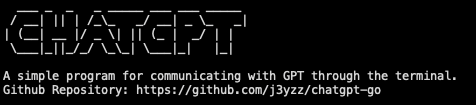

# ChatGPT CLI Tools

---
<div>
    
</div>

### Installation

1. Clone the repository:
```bash
git clone https://github.com/j3yzz/chatgpt-go.git
```

2. Navigate to the repository directory:
```bash
cd chatgpt-go 
```

3. Duplicate the sample_config.json file and rename it to config.json. Obtain your API secret key from the OpenAI platform at https://platform.openai.com/account/api-keys.
 

4. Run the following command to start the tool:
```bash
./main
```

Note: Ensure that you have the necessary dependencies installed and that your system meets the requirements before running the tool.